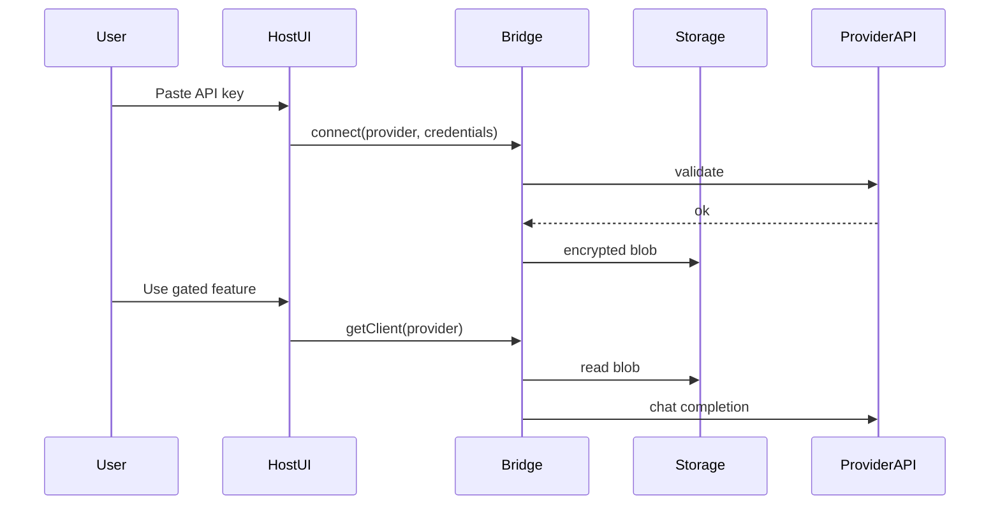

# Integration guide

## Architecture

Host apps instantiate `createAccountBridge` with three pieces:

1. **Storage adapter** — where encrypted credential blobs live
2. **Provider registry** — OpenAI, Anthropic (or custom providers)
3. **Encryption key** — derived from your auth session; never hard-coded



## Storage adapters

### Memory (tests / ephemeral)

```ts
import { memoryStorage } from '@account-bridge/core';
```

### File (Node CLI / local agents)

```ts
import { fileEncryptedStorage } from '@account-bridge/core/node';
```

Files land in `~/.account-bridge/<namespace>/` with mode `0600`.

### IndexedDB (browser)

```ts
import { localEncryptedStorage } from '@account-bridge/core/browser';

const storage = localEncryptedStorage({ namespace: 'my-app' });
```

## Encryption key

Derive from something only your authenticated user knows:

```ts
import { deriveKeyFromSecret } from '@account-bridge/core';

getEncryptionKey: async () => ({
  key: await deriveKeyFromSecret(sessionToken, 'account-bridge-v1'),
}),
```

If the session ends, credentials remain encrypted but unusable until the user re-authenticates.

## Feature gating

### Imperative

```ts
import { requireProvider } from '@account-bridge/core';

await requireProvider(bridge, 'openai');
const client = await bridge.getClient('openai');
```

### React

```tsx
import { FeatureGate, ConnectProviderForm, useProviderConnected } from '@account-bridge/react';

function MyFeature() {
  const connected = useProviderConnected('openai');
  // auto-updates when bridge.subscribe fires
}
```

## Server proxy (production browser apps)

Do **not** ship user API keys in client-side bundles for production. Instead:

1. User connects key via your authenticated settings page (server-side `connect`)
2. Store encrypted blob in your database (implement `CredentialStore`)
3. Proxy chat requests through your backend using `getClient`

See `examples/node-proxy`.

## MCP (Cursor / agents)

```bash
# packages/mcp — stdio tools: connect, disconnect, list, chat
```

See [`packages/mcp/README.md`](../packages/mcp/README.md).

## Streaming

```ts
const client = await bridge.getClient('openai');
for await (const chunk of client.stream!([{ role: 'user', content: 'Hi' }])) {
  process.stdout.write(chunk);
}
```

## Custom providers

Use `createOpenAICompatibleProvider` or `createProviderRegistry`:

```ts
import { createOpenAICompatibleProvider, createProviderRegistry } from '@account-bridge/core';

const registry = createProviderRegistry([
  createOpenAICompatibleProvider({ id: 'groq', displayName: 'Groq', baseUrl: 'https://api.groq.com/openai' }),
]);
```

See [`provider-catalog.md`](./provider-catalog.md).

## OpenAI-compatible gateway (v0.3)

Mount once; any AI stack changes `baseURL`:

```ts
import { mountAccountBridgeGateway } from '@account-bridge/adapters/express';
```

Routes: `GET /v1/models`, `POST /v1/chat/completions` (SSE when `stream: true`).

Adapters:

- `@account-bridge/adapters/openai` — OpenAI SDK / LangChain preset
- `@account-bridge/adapters/vercel-ai` — Vercel AI SDK preset
- `@account-bridge/adapters/express` — Express middleware

See [`quickstart-host.md`](./quickstart-host.md).

## Settings UI (v0.3)

```tsx
import { AccountBridgeSettings } from '@account-bridge/react';

<AccountBridgeSettings getOAuthStartUrl={(key) => `/account-bridge/oauth/${key}/start`} />
```

## OAuth + SQL store (v0.3)

```ts
import { sqlCredentialStore, mountAccountBridgeOAuth } from '@account-bridge/server';
```

Google OAuth → Gemini credentials. See [`supabase-hosting.md`](./supabase-hosting.md).

## R2 ecosystem adoption (optional)

When embedding in R2 portfolio apps:

- Add `@account-bridge/react` to operator or member Settings
- Implement a Supabase-backed `CredentialStore` with RLS per `auth.uid()`
- Proxy provider calls through an Edge Function

The library has no R2-specific dependencies.
